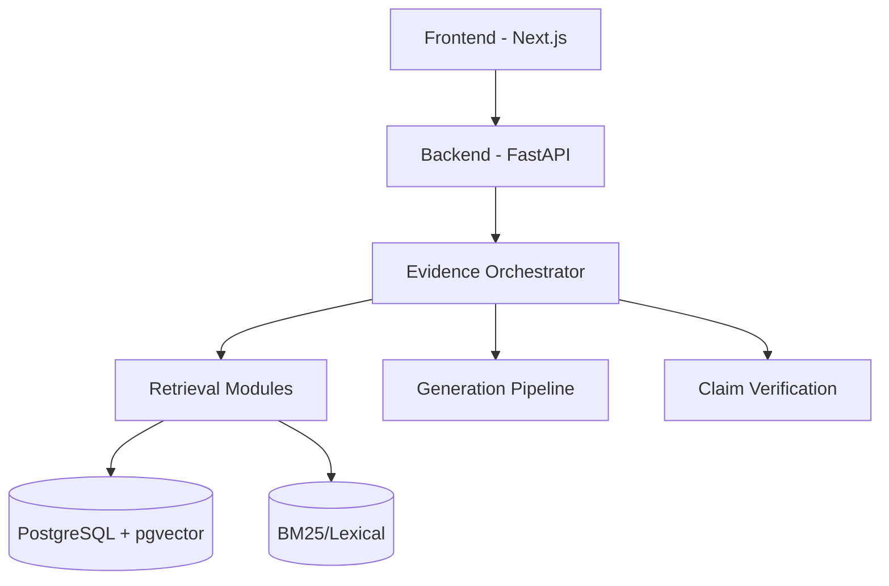

# SENTINEL-RAG Architecture

## 1. Project Overview
**SENTINEL-RAG** (Self-Evaluating Evidence-Navigating, Trust-Calibrated, Intelligent and Latency-Aware Retrieval-Augmented Generation) is a closed-loop evidence orchestration framework designed for reliable, cost-aware, conflict-resilient, and verifiable RAG.

## 2. Problem Statement
Traditional RAG systems use a fixed-budget retrieval mechanism (e.g., retrieve top-K documents and generate). This leads to incorrect answers when evidence is lacking, high costs when queries are simple, hallucinations when chunks conflict, and a lack of proper claim verification.

## 3. Design Goals
*   **Correctness and Faithfulness**: Answers must strictly rely on retrieved evidence.
*   **Cost and Latency Awareness**: Dynamically adapt retrieval effort based on query complexity.
*   **Conflict Resilience**: Detect and resolve contradictions in retrieved data.
*   **Verifiability**: Independent claim verification decoupled from the generation step.
*   **Modularity**: Clear separation of ingestion, retrieval, orchestration, generation, and verification.

## 4. Non-Goals
*   General-purpose ungrounded chatting.
*   Implementing learned policies (RL) before establishing a strong deterministic baseline.
*   Handling unstructured audio/video ingestion (focus on text/documents initially).

## 5. High-level Architecture

## 6. Component Architecture
*   **Frontend**: Next.js, TypeScript.
*   **Backend**: Python, FastAPI, Pydantic.
*   **Database**: PostgreSQL with `pgvector` extension.
*   **Cache/State**: Redis.
*   **LLM/Embedding**: Configurable provider wrappers.
*   **Evaluation**: Custom Python framework.

## 7. Data Flow
1. User submits query via API.
2. Evidence Orchestrator initiates an adaptive retrieval loop.
3. System performs Hybrid Retrieval (Vector + BM25).
4. Results are Reranked (Cross-encoder).
5. Orchestrator evaluates evidence sufficiency.
6. If sufficient, Context Construction formats the prompt.
7. LLM Generates draft claims and answer.
8. Claim Verification checks each claim against evidence.
9. Verified answer is returned; if unsupported, answer is repaired or system abstains.

## 8. Document Ingestion Pipeline
Documents are uploaded -> Parsed -> Chunked -> Embedded -> Stored in PostgreSQL (chunks, embeddings) and BM25 index. Metadata (version, publication date) is extracted and tracked.

## 9. Retrieval Architecture
Retrieval is completely decoupled from generation. It operates through modular strategies (Vector, BM25, Graph) and is controlled by the Orchestrator.

## 10. Hybrid Retrieval
Queries are executed against both vector embeddings (pgvector) and lexical indices (BM25). The results are fused (e.g., via Reciprocal Rank Fusion or normalized scoring) before reranking.

## 11. Reranking
A cross-encoder reranker scores the fused candidate chunks against the query to ensure high precision before passing chunks to the context window.

## 12. Evidence Orchestrator
The central control loop. Determines deterministic actions:
`A0 = ANSWER`, `A1 = RETRIEVE_MORE`, `A2 = REFORMULATE_QUERY`, `A3 = VECTOR_SEARCH`, `A4 = BM25_SEARCH`, `A5 = GRAPH_SEARCH`, `A6 = CHECK_SOURCE_VERSION`, `A7 = RESOLVE_CONFLICT`, `A8 = REPAIR_ANSWER`, `A9 = ABSTAIN`.

## 13. Evidence Sufficiency
Calculates a conceptual system-level score:
`S_evidence = w_r*R + w_c*C + w_a*A + w_f*F + w_i*I - w_x*X`
(Relevance, Coverage, Authority, Freshness, Independence, Contradiction).

## 14. Evidence Independence
The system tracks source duplication. Identical statements from multiple copies of the same document do not inflate the evidence independence score.

## 15. Evidence Graph
A mapping of relationships between documents, chunks, and claims, facilitating multi-hop reasoning and contradiction tracking.

## 16. Provenance
Every final answer claim traces back precisely:
`Query -> Retrieval Event -> Chunk -> Document -> Version -> Claim -> Answer`.

## 17. Temporal/Version Reasoning
Documents hold `publication_date`, `effective_date`, and `version`. The system can distinguish between chronological changes, supersessions, and hard contradictions.

## 18. Claim Verification
Generation produces a draft answer and explicit claims. A separate verification module matches claims against retrieved evidence, classifying them as: `SUPPORTED`, `PARTIALLY_SUPPORTED`, `CONTRADICTED`, `UNSUPPORTED`.

## 19. Answer Repair
If verification detects `UNSUPPORTED` or `CONTRADICTED` claims, the Orchestrator initiates a repair step, rewriting the answer to strictly reflect only the supported claims.

## 20. Abstention
If evidence remains insufficient after the retrieval budget is exhausted, the Orchestrator chooses `A9 = ABSTAIN`, explicitly refusing to answer rather than hallucinating.

## 21. Budget Management
Strict configurations govern execution loops to prevent infinite retrieval. Configurable limits on rounds, chunk counts, context tokens, LLM calls, cost, and latency.

## 22. Cost Tracking
Tokens (prompt, completion) are tracked per module (embedding, generation, verification) and aggregated per query to calculate accurate operational costs.

## 23. Latency Tracking
End-to-end and component-level latency are logged for every query trace.

## 24. Caching
Redis handles semantic/exact query caching and intermediate state caching to bypass redundant LLM and retrieval calls.

## 25. Observability
"RAG Flight Recorder": Every query produces a reproducible execution trace including cache status, token usage, decisions made, latency, and conflict resolutions.

## 26. Security
Implements authentication, tenant isolation, strict file size limits, environment secrets protection, safe logging, rate limiting, and defensive prompting (treating retrieved docs as untrusted data to mitigate prompt injection).

## 27. Database Architecture
PostgreSQL tables: `documents`, `chunks`, `claims`, `document_relationships`, `evidence_links`, `query_logs`, `query_traces`.

## 28. API Architecture
REST API via FastAPI:
*   `GET /health`
*   `POST /documents/upload`
*   `GET /documents`, `GET /documents/{id}`, `DELETE /documents/{id}`
*   `POST /documents/{id}/reindex`
*   `POST /query`
*   `POST /evaluation/run`, `GET /evaluation/results`
*   `GET /traces/{id}`, `GET /metrics`, `GET /system/status`

## 29. Frontend Architecture
Next.js application providing search interface, source document viewer, and RAG Flight Recorder observability UI.

## 30. Deployment Architecture
Docker and Docker Compose for containerized local and staging deployments.

## 31. Failure Handling
Graceful degradation: API rate limits trigger exponential backoff. Model failures fallback to secondary providers or trigger safe abstention.

## 32. Scalability
Stateless backend services scale horizontally. PostgreSQL scales vertically or via read replicas. Redis cluster handles distributed caching.

## 33. Future Extensions
Learned policies (RL) for the Evidence Orchestrator, multi-modal ingestion, and streaming architectures.
